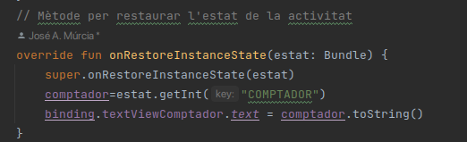

# Ampliant el Comptador

## 1. Anàlisi de l’estructura del projecte
Projecte creat en Android Studio, el qual utilitza Gradle com a ferramenta de la construcció d'aquest i Kotlin com a llenguatge de programació.

A continuació vegem l'estructura generada del projecte, en dues vistes diferents, vista Android i vista dels fitxers del projecte (Project Files).
### * Imatge de esquerra vista Project Files.  * Imatge dreta Vista Android 
    

En la imatge de l'esquerra podem observar l'estructura del projecte creat amb Gradle i tots els fitxers generats de la aplicació, amb els directori arrel, la carpeta de app, i els fitxers més importants que ara nomenarem. Amb la imatge de la dreta, la vista de tots els directoris i fitxers és més compacta.

### Elements importants:
* Els scripts de Gradle tant el general, situat en el arrel (build.gradle.kts), com el propi de la APP (app/build.gradle.kts). Des de la vista android aquests 2 scripts estan dins de Gradle Scripts, on indica si és el pròpi del projecte o del mòdul.

* En la vista Project Files, dins de la carpeta app/src/main, trobem el codí font de la aplicació. A la vista Android el codi font es troba en la carpeta java. En la vista Android trobem la carpeta de recursos dins de app/res i s'observa de forma més compacta.
  
 

* La carpeta app/src/res conté els recursos de la Aplicació, ja siguen, imatges, dissenys etc. Aquesta carpeta està desglosada en diferents subcarpetes, per a gestionar els diferents tipus de recursos. En la vista de Android el contingut de recursos es mostra de forma més compacta.
  
 

* Finalment un dels fitxer més importants del projecte (app/AndroidManifest.xml), ja que aquest defineix els aspectes generals de la aplicació.

   

## Analitza l’estructura d’una Activitat i quins fitxers estan implicats. 
Aquests són els fitxers d'una activitat:
* La classe de l'activitat i els seus mètodes importants al fitxer MainActivity.kt, aquesta classe normalment hererta de AppCompatActivity (class MainActivity : AppCompatActivity() {). En aquest part és on s'implementa la lògica de l'activitat.

* Els recursos de Layout, on cada activitat té associat un disseny i es defineix a un fitxer XML. Aquest fitxer es troba a la carpeta res/layout (activity_main.xml)

* AndroidManifest.xml, en aquest fitxer, conté les declaracions de les activitats e informació importatn de la aplicació.
  
## Intenta respondre a la següent pregunta: “Si volguera afegir una nova activitat, sería suficient crear el fitxer de layout i el fitxer Kotlin amb la classe?”
A la següent pregunta, no seria suficient ja que s'ha d'implementar la activitat al fitxer més important, que és el AndoidManifest.xml.
  
## 2. Análisi del clicle de vida i el problema de la pèrdua d’estat
* Per a analitzar el cicle de vida, he utilitzat els següents mètodes de la classe Activity:
 
 

* Aquests són els resultats al interactuar amb la aplicació.

* El problema de la perdua d'estat, és, que al haber algún canvi d'activitat com per exemple girar la pantalla, no guarda la activitat del moment. En aquesta cas, és el valor del comptador.

## 3. Solució a la pèrdua d’estat

Per solucionar la pèrdua d'estat, em fet ús de 2 mètodes de la classe Activity, onSaveInstanceState(estat: Bundle) i
onRestoreInstanceState(estat: Bundle) En el primer mètode guardem el estat del comptador, quan es detè o hi ha algún canvi d'activitat.

 En el segón mètode, restaurem el estat de l'activitat després d'algún canvi de configuració. Guardem el estat en la variable comptador i finalment s'actualitza el text amb al valor del comptador convertit a cadena

## 4. Ampliant la funcionalitat amb decrements i Reset

Per ampliar la funcionalitat amb decrements i reset. Primerament em afegit 2 recursos més al fitxer activity_main.xml, en aquest càs 2 botons, el de restar i el de resetejar el comptador.

Despŕes el MainActivity.kt, hem aplicat la lògica que correspon als botons per a que interactuen de manera adequada.

## 5. Canvis per implementar el View Binding
